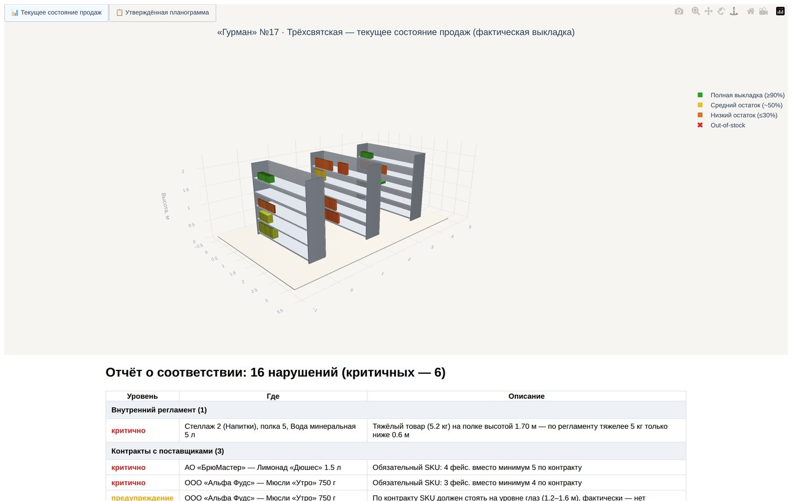
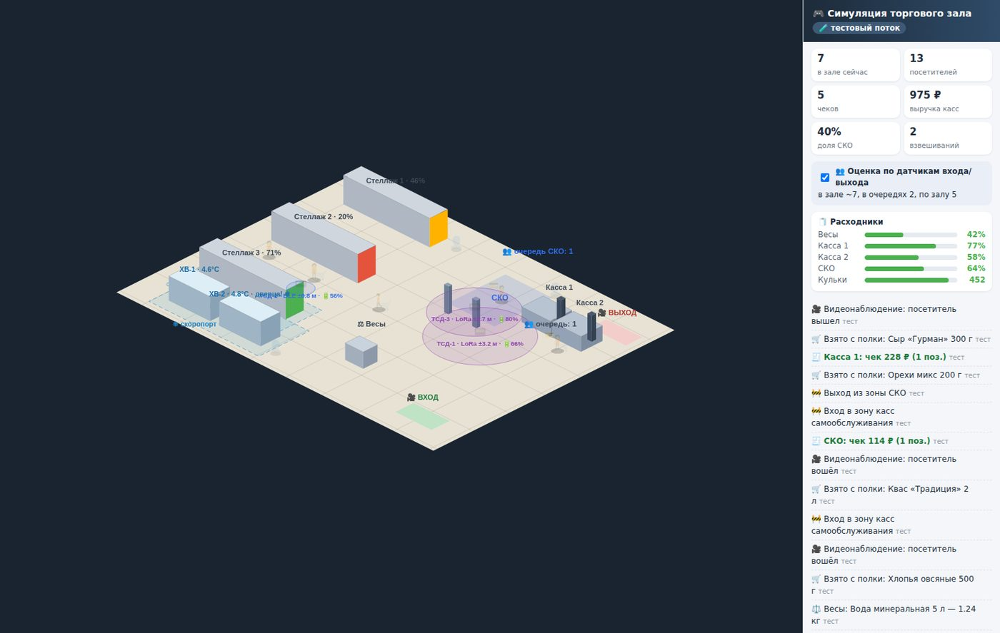
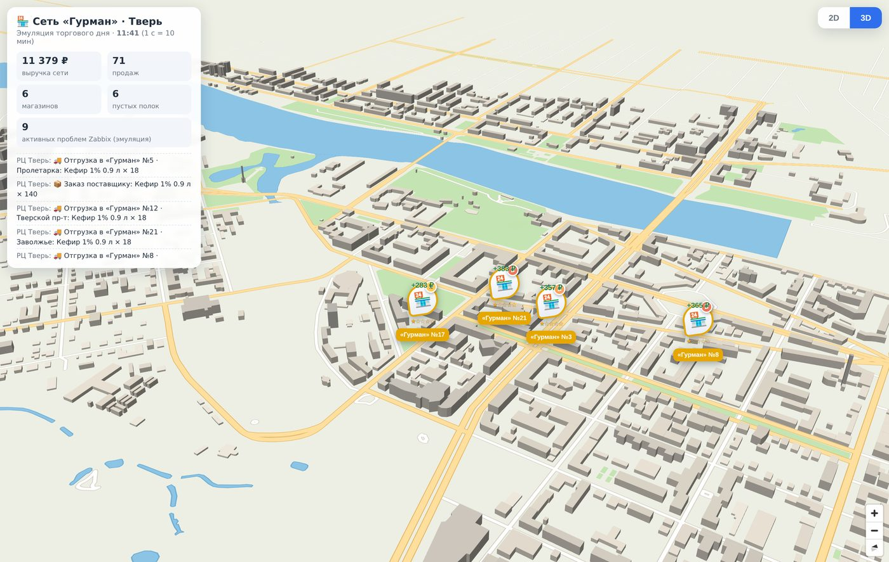

# 3D-инновация для ERP: зачем мы сделали свой модуль вместо покупки вендорского

*Программная статья о том, почему пространственные данные ERP заслуживают
пространственного интерфейса, и почему самодельный 3D-модуль оказался
быстрее, дешевле и стратегически правильнее готовых решений.*

---

## 1. ERP слепа: главная нерешённая проблема учётных систем

ERP-система знает о магазине всё: номенклатуру, остатки, цены,
контракты поставщиков, маршруты доставки, смены сотрудников. Но
показывает она это всегда одинаково — **таблицами и формами**. Между
тем половина данных ритейла по своей природе пространственна:

* планограмма — это *место* товара на *полке* конкретного *стеллажа*;
* остатки — это *глубина стопки* на полке, видимая глазом;
* сеть — это *точки на карте города* с расстояниями и маршрутами;
* доставка — это *координаты курьера* между *адресами*;
* торговый зал — это *очереди*, *зоны* и *датчики* в реальной геометрии.

Когда пространственные данные показывают таблицей, работу интерпретации
выполняет человек: мерчандайзер в уме «рисует» полку по строкам Excel,
диспетчер в уме «едет» по маршруту из списка адресов, супервайзер в
уме «видит» зал по сводке камер. Это медленно, требует опыта и
порождает ошибки — самые дорогие ошибки ритейла (пустая полка,
нарушенный контракт, сорванное окно доставки) живут именно в этом
зазоре между таблицей и пространством.

**3D-инновация — это не «красивые картинки». Это перенос интерпретации
с человека на систему**: полка с товаром выглядит как полка с товаром,
пустеющая выкладка краснеет, грузовик едет по карте, очередь видна как
очередь. ERP перестаёт быть слепой.


*Те же данные, что в учётной системе (номенклатура, остатки, выкладка),
— но в виде, где out-of-stock виден за секунду, а не находится
фильтром по отчёту.*

## 2. Пять контуров ERP, которым 3D даёт новое качество

Модуль planogram3d закрывает пространственным интерфейсом пять
классических контуров ERP:

| Контур ERP | Что даёт 3D-модуль | Раздел системы |
|---|---|---|
| Мерчандайзинг / MDM | 3D-планограммы: утверждённая выкладка против факта, теплокарта остатков, автоматический контроль регламента и контрактов поставщиков | `/store/<id>` |
| Запасы / WMS | цифровой двойник зала: полки, склад, логистический центр-буфер с рейсами на карте города | `/`, карточка РЦ |
| IoT / мониторинг | зал с датчиками: очереди, ТСД (BLE/LoRa), холодильники, расходники, Zabbix на каждом магазине | `/store/<id>/live` |
| TMS / доставка | сборка интернет-заказов, маршруты, диаграмма Ганта план/факт, GPS-курьеры на карте, фискальный чек при вручении | `/delivery` |
| HR / обучение | игровой тренажёр персонала на реальной планограмме, командные смены до 10 ролей, ИИ-агенты по API | `/store/<id>/game` |


*Один экран вместо пяти отчётов: очереди, позиционирование ТСД,
телеметрия холодильников, расходники касс, зоны скоропорта.*

Существенно, что все пять контуров работают **на одних данных**: та же
номенклатура, что в планограмме, лежит на полках тренажёра и в
корзинах интернет-заказов. В вендорских решениях это пять продуктов
пяти поставщиков с пятью интеграциями; здесь — один самодельный модуль
с одной моделью данных.

## 3. Самодельный модуль как стратегия, а не компромисс

«Самодельный» звучит как оправдание. На практике это стратегический
выбор со следующими аргументами.

### 3.1. Размер задачи меньше, чем кажется

Ядро модуля — `planogram3d.core` — это ~850 строк Python с одной
внешней зависимостью (plotly). Модель данных, движок проверок
соответствия, 3D-сцены и отчёты. Веб-слой — Flask и ванильный
JavaScript, карта — MapLibre с выгрузкой OpenStreetMap, лежащей в
репозитории. Ни одна часть не является rocket science: вся система
собрана короткими итерациями, и каждая итерация заканчивалась
работающим, протестированным экраном.

Индустрия приучила считать 3D «дорогой» технологией, потому что
вендорские 3D-платформы дороги. Но браузер 2026 года рендерит
изометрический зал на canvas и город на WebGL бесплатно; данные для
этого уже лежат в ERP.

### 3.2. Полный контроль данных и доработки

Планограммы, продажи, контракты — коммерчески чувствительные данные.
Самодельный модуль не отправляет их в чужое облако, не требует
лицензий на рабочее место и не ставит доработку в очередь к вендору.
Новое требование бизнеса («подсветите зоны скоропорта», «добавьте учёт
кульков для овощей») — это дни своей разработки, а не квартал
согласований.

### 3.3. Интеграция через одну точку

Весь модуль наполняется через **один объект `Store`**: магазины,
стеллажи, товары, поставщики, контракты, две планограммы (план/факт),
продажи. ERP любого происхождения — 1С, SAP, Odoo, самописная учётка —
интегрируется адаптером в несколько десятков строк: выгрузка в CSV или
REST-запросы. Обратный поток — тоже стандартный: события касс и CCTV,
GPS курьеров, телеметрия холодильников принимаются простыми
JSON-эндпоинтами, а отчёты о нарушениях и алерты возвращаются в ERP и
мониторинг.

```
ERP / 1С / WMS ──(адаптер: CSV, REST)──► Store ──► 3D-сцены
кассы, CCTV, GPS, Zabbix ──(JSON-события)──► двойник ──► алерты в ERP
```

### 3.4. Эмуляторы вместо ожидания интеграций

Приём, сэкономивший больше всего времени: каждый внешний контур
(Zabbix, кассы, GPS, Roblox) имеет встроенный эмулятор с тем же
интерфейсом, что и реальный источник. Модуль полноценно живёт и
демонстрируется без единой настроенной интеграции — а подключение
реального источника сводится к переменным окружения. Для самодельного
модуля это критично: демо работает в первый день, интеграции
подключаются по мере готовности смежников.

### 3.5. Стоимость владения

Сравнение честное только по полной стоимости: лицензии вендорского
3D-мерчандайзинга на сеть + внедрение + ежегодная поддержка + плата за
каждую доработку против зарплатных недель своей команды на модуль,
который дальше дорабатывается в темпе бизнеса. Для сети из десятков
магазинов самодельный вариант выигрывает кратно — и остаётся активом,
а не подпиской.

## 4. Что делает модуль инновационным, а не просто «своим»

Собственная разработка сама по себе не инновация. Инновация — в
сочетаниях, которых нет в готовых продуктах:

1. **Планограмма как живой объект.** Не картинка для согласования, а
   3D-сцена, в которой остатки меняются в реальном времени, а проверка
   регламента и контрактов запускается при каждом построении.
2. **Один двойник — все роли.** Мерчандайзер, супервайзер, диспетчер,
   HR и студент-стажёр смотрят на один и тот же зал — каждый своим
   экраном.
3. **Тренажёр на боевых данных.** Обучение персонала происходит на
   реальной планограмме магазина — навык переносится без «переучивания
   с учебного на настоящее» (см. методичку).
4. **Роль не знает, кто её исполняет.** Человек, встроенный бот и
   внешний ИИ подключаются к смене одним API — готовый полигон для
   постепенного замещения ролей ИИ-агентами (см. роадмап A0–A5).
5. **Город как интерфейс.** Сеть, логистика и доставка живут на
   реальной карте города (OpenStreetMap), а не в списке филиалов.


*Карта сети — это тоже интерфейс к ERP: выручка, пустые полки, рейсы
РЦ и проблемы Zabbix на каждом магазине города.*

## 5. Дорожка внедрения для действующей ERP

**Неделя 1–2. PoC на своих данных.** Выгрузить из ERP планограмму и
остатки одного магазина (CSV), собрать `Store` адаптером по примерам
из `docs/INTEGRATION.md`, получить 3D-отчёт с проверкой соответствия.
Критерий успеха: мерчандайзер сети находит в отчёте реальное нарушение.

**Месяц 1. Пилотный магазин.** Регулярная выгрузка (ночной джоб),
отчёты в почту категорийным менеджерам, подключение Zabbix. Тренажёр —
для онбординга новичков пилотного магазина.

**Квартал. Сеть.** Карта всех магазинов, РЦ и доставка на реальных
потоках (кассовые события, GPS курьерского приложения), командные
тренировки смен, первый теневой ИИ-агент диспетчера.

Каждый шаг оставляет работающий артефакт; ни один не требует
«большого внедрения» с остановкой процессов.

## 6. Выводы

* Пространственные данные ERP заслуживают пространственного
  интерфейса; 3D в 2026 году — это не стоимость, а решение.
* Самодельный модуль — стратегический актив: контроль данных, темп
  доработок, нулевые лицензии, интеграция через одну точку.
* Инновация живёт в сочетаниях: живая планограмма + двойник зала +
  тренажёр + ИИ-полигон на одних данных — этого не купить в коробке.
* Начать можно с PoC на две недели: CSV из ERP → 3D-отчёт с
  проверкой соответствия.

*Технические детали: справочник API (`/docs/library`), руководство по
интеграции (`/docs/integration`), методичка обучения
(`/docs/article`), роадмап ИИ-сотрудников (`/docs/roadmap`).*
