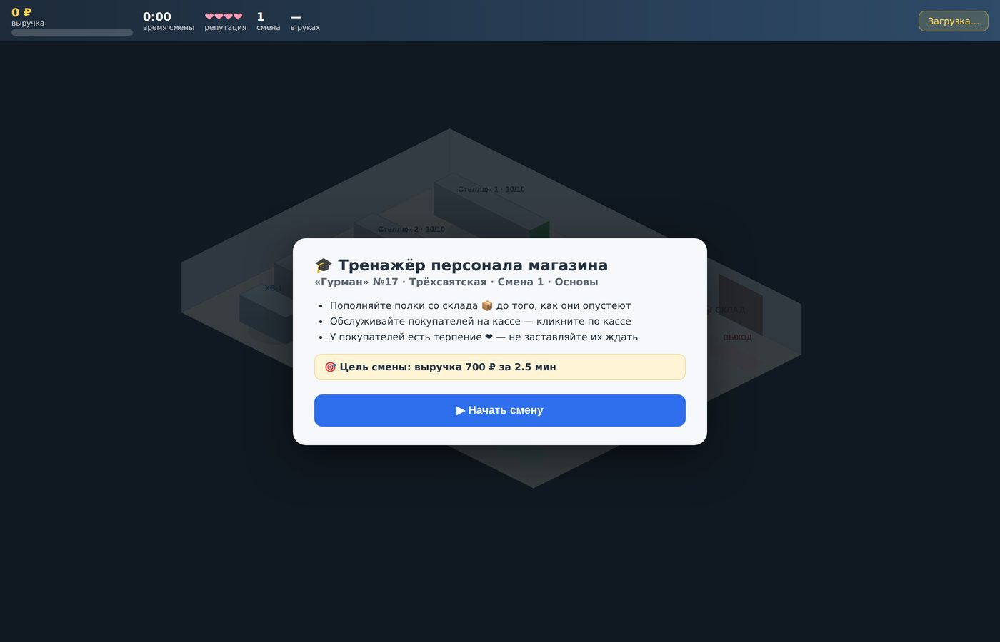
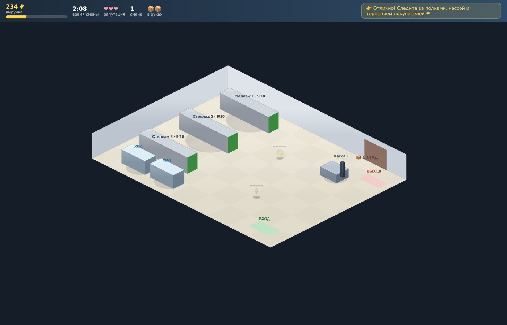
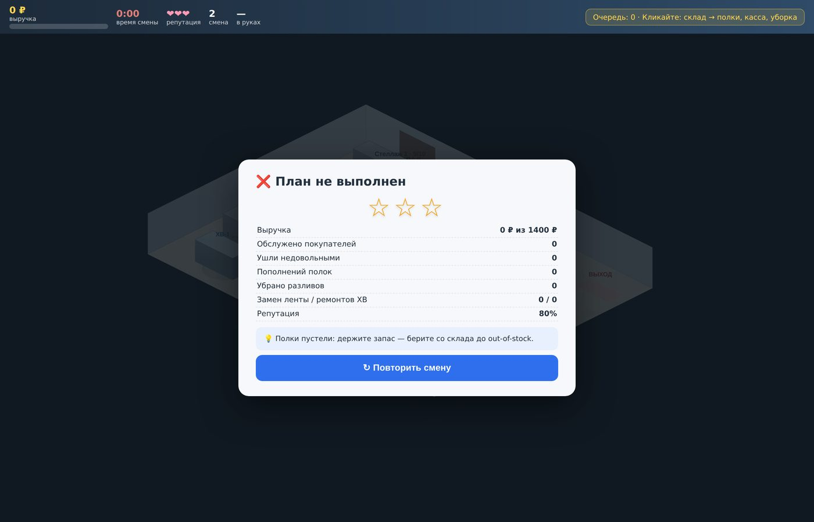
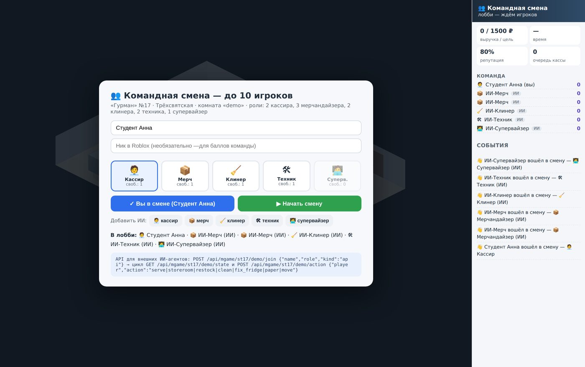
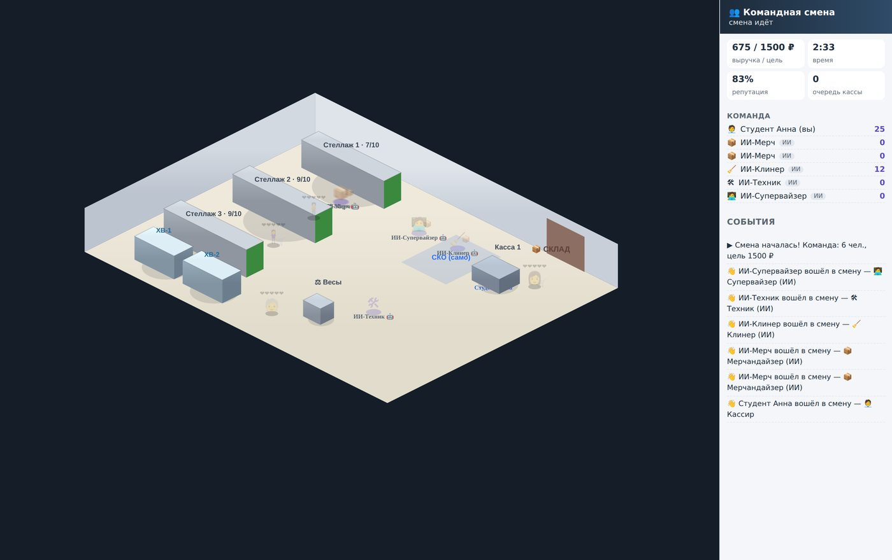
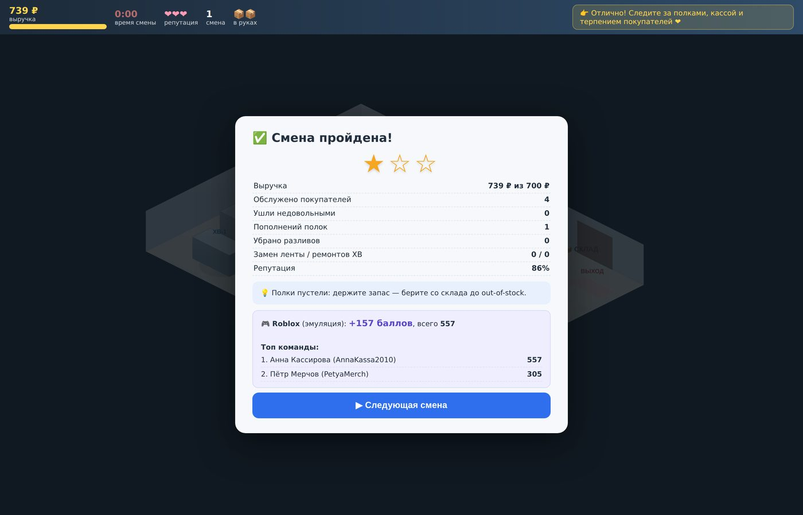
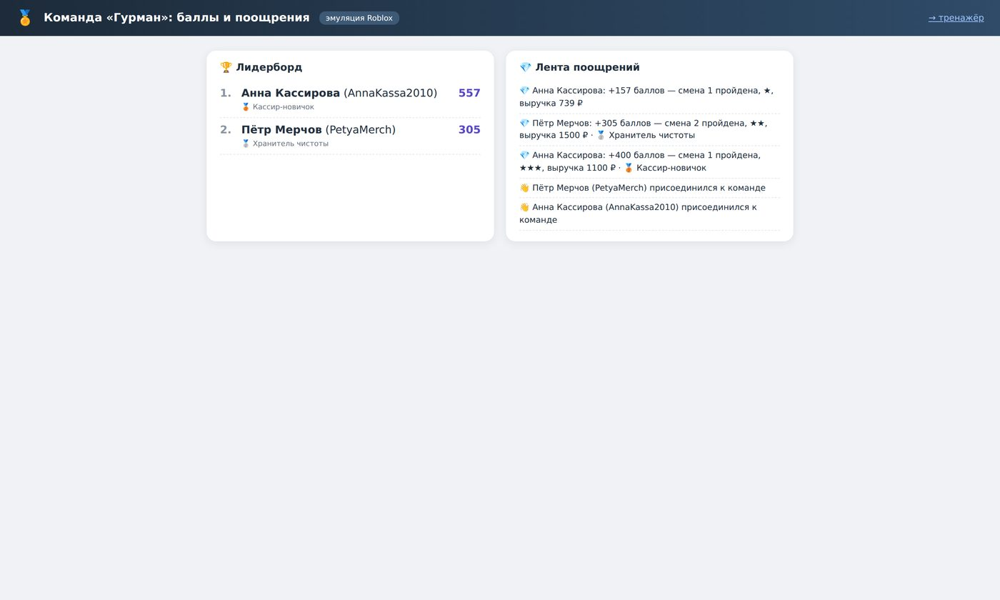

# Смена как игра: методичка по обучению команды магазина в симуляторе planogram3d

*Методическое пособие для руководителей розницы, T&D-специалистов,
наставников и преподавателей колледжей торговых специальностей.
Описывает педагогические основания, устройство тренажёра, программу
из трёх модулей с поурочными планами, рубрики оценивания, работу
наставника и организацию занятий.*

---

## 1. Введение: для кого и зачем эта методичка

Перед вами пособие по обучению линейного персонала магазина —
кассиров, мерчандайзеров, клинеров, техников и супервайзеров — с
помощью игрового симулятора planogram3d. Методичка рассчитана на три
аудитории:

* **руководитель магазина или сети** — получает готовую программу
  онбординга новичков и командных тренировок действующих смен;
* **T&D-специалист / наставник** — получает поурочные планы, сценарии
  дебрифа, рубрики оценивания и чек-листы;
* **преподаватель колледжа** (специальности «Коммерция», «Товароведение»,
  ИТ) — получает курс практических занятий, включая модуль
  программирования ИИ-агентов.

Что потребуется: любой компьютер с браузером и запущенная демо-система
(`python -m planogram3d.webapp`, установка занимает ~10 минут). Для
командных занятий — по компьютеру на студента в одной сети с сервером.
Никакого специального оборудования.


*Тренажёр — часть цифрового двойника торговой сети: карта города с
живой эмуляцией продаж, из которой обучающийся «входит» в свой магазин.*

## 2. Проблема, которую решает методика

Розница обучает персонал в худших из возможных условий. Высокая
текучка делает дорогим любое длинное обучение: вкладываться на месяцы
в сотрудника, который может уйти через квартал, экономически трудно
оправдать. Наставник занят собственной сменой — у него нет ни времени,
ни инструментов для систематической работы с новичком. А цена ошибки
ученика — не оценка в зачётке, а реальные покупатели, реальная выручка
и реальные санкции поставщиков за пустую полку или нарушенную
контрактную выкладку.

Классические курсы и регламенты дают знания «о работе», но не дают
главного — **опыта скоординированной работы смены**, где кассир,
мерчандайзер, клинер и техник зависят друг от друга ежеминутно.
Очередь на кассе — это не «проблема кассира»: она возникает, когда
мерчандайзер не успел с выкладкой и покупатели задержались у пустых
полок, когда техник не заменил ленту заранее, когда супервайзер не
увидел пик потока и не открыл вторую кассу. Этой связности не учит ни
один учебник — её можно только прожить.

### 2.1. Почему симулятор

Отрасли с дорогой ценой ошибки давно решили эту проблему тренажёрами:
пилоты налётывают первые сотни часов в авиасимуляторе, хирурги
отрабатывают операции на симуляционных стендах, операторы робо-такси
обучают и экзаменуют автопилот на цифровых полигонах, прежде чем
выпустить его на улицу. Розница по цене ошибки, конечно, скромнее
авиации, но по **массовости** обучения превосходит её на порядки — а
значит, выигрыш от переноса первых десятков часов практики в безопасную
среду огромен.

Методика planogram3d переносит этот опыт в ритейл: симулятор построен
не на условном «магазине вообще», а на **цифровом двойнике конкретного
магазина** — реальная планограмма, реальные SKU и цены, реальные
процессы: пополнение через логистический центр, кассы и СКО, весы,
холодильники, расходники, мониторинг Zabbix.

### 2.2. Педагогические основания

Методика опирается на три известных принципа обучения взрослых:

1. **Деятельностный подход**: навык формируется в действии, а не в
   прослушивании. В тренажёре обучающийся с первой минуты *делает* —
   пополняет, обслуживает, убирает, чинит.
2. **Модель 70-20-10**: 70% профессионального развития даёт опыт
   работы, 20% — взаимодействие с коллегами, 10% — формальное обучение.
   Симулятор искусственно «уплотняет» первые две составляющие: за
   30-минутное занятие студент проживает событий больше, чем за
   неделю спокойных смен.
3. **Цикл Колба** (опыт → рефлексия → обобщение → эксперимент):
   каждая смена завершается структурированным разбором с объективными
   метриками, а следующая смена — это эксперимент с новой стратегией.

## 3. Устройство тренажёра: что видит обучающийся

### 3.1. Цифровой двойник магазина

Тренажёр — верхний слой системы planogram3d. Под ним лежат:
3D-планограммы с контролем соответствия регламенту и контрактам
поставщиков, живая карта сети с логистическим центром, симуляция
торгового зала с датчиками (очереди, ТСД, холодильники, расходники),
доставка интернет-заказов. Обучающийся работает в том же зале, с теми
же стеллажами и теми же товарами, которые мерчандайзер сети видит в
рабочих инструментах.


*Та же планограмма, что в тренажёре: три стеллажа, реальные SKU,
теплокарта остатков. Красное — out-of-stock.*


*«Взрослый» слой системы: очереди у касс, ТСД с BLE/LoRa-позиционированием,
холодильники с телеметрией, зоны скоропорта. Тренажёр использует тот же
зал — переучиваться с «учебного магазина» на настоящий не придётся.*

### 3.2. Соло-тренажёр: три смены

Одиночный режим (`/store/<id>/game`) — точка входа для новичка. Это
игра в жанре тайм-менеджмента: обучающийся управляет сотрудником,
кликая по объектам зала; сотрудник ходит, берёт товар со склада,
пополняет полки, встаёт за кассу, убирает разливы, меняет чековую
ленту и реагирует на тревоги холодильников.


*Брифинг перед сменой: цель по выручке, время, правила. Здесь же
регистрация — имя и ник Roblox для командного зачёта.*

Сценарий из трёх смен построен по нарастающей:

| Смена | Название | Новые механики | Чему учит |
|---|---|---|---|
| 1 | Основы | склад → полки → касса, терпение покупателей | базовый цикл работы зала, приоритет кассы |
| 2 | Чистота и лента | разливы на полу, расход чековой ленты | периферийное внимание, профилактика вместо реакции |
| 3 | Час пик | тревоги холодильников, плотный поток, нетерпеливые покупатели | приоритизация под нагрузкой, работа с несколькими источниками событий |


*Смена 1: сотрудник несёт коробки со склада, покупатели с «сердечками»
терпения идут к стеллажам. Пунктир — очередь заказанных действий.*

Первая смена включает пошаговый туториал («кликните на склад…»), и это
принципиально: новичок без опыта игр осваивает управление за 2–3
минуты. Управление намеренно примитивно — только клики; методика
обучает работе магазина, а не ловкости рук.

### 3.3. Разбор смены

Каждая смена заканчивается экраном результатов: выполнен ли план,
звёзды (1–3), детальная статистика и — главное — **автоматические
советы-разборы**, привязанные к фактическим ошибкам: «Много потерянных
покупателей — обслуживайте кассу раньше, чем кончится терпение»,
«Полки пустели: держите запас, берите со склада до out-of-stock».


*Разбор смены: план/факт, статистика действий, советы по конкретным
ошибкам. Фактура для дебрифа с наставником.*

### 3.4. Командная смена: до 10 игроков

Командный режим (`/store/<id>/game/multi`) — ядро методики. До десяти
участников входят в **общую** смену: один зал, одни покупатели, одна
цель по выручке. Роли с лимитами: 2 кассира, 3 мерчандайзера,
2 клинера, 2 техника, 1 супервайзер.


*Лобби: выбор роли (видны свободные слоты), добавление ИИ-ботов на
недостающие роли, подсказка API для внешних агентов.*

Два правила создают командную динамику:

1. **«Не своя работа — медленнее».** Любой может делать любую работу,
   но вне своей роли — с заметным штрафом по времени. Кассир может
   пополнить полку, но потратит вдвое больше времени, чем мерчандайзер.
2. **Касса не работает без кассира.** Штатная касса обслуживает только
   пока за ней стоит игрок; зона СКО работает сама, но медленно. Уход
   кассира «на минутку помочь» немедленно строит очередь.


*Командная смена: студент-кассир и пять ИИ-ботов. Справа — ростер с
баллами каждого и живая лента событий.*

### 3.5. Долгая мотивация: Roblox

Баллы за смены и бейджи за пройденные кейсы («Кассир-новичок»,
«Хранитель чистоты», «Герой часа пик», «Наставник смены») копятся в
командном лидерборде и через Open Cloud транслируются в Roblox-опыт
сети — поощрение видно коллегам в привычной игровой среде.


*Итог смены с начислением: +157 баллов, топ команды. Для студентов
поколения Roblox это родная система прогресса.*


*Командный лидерборд и лента поощрений — доска почёта смены.*

## 4. Пять принципов методики

### Принцип 1. Реальные процессы вместо учебных условностей

Студент пополняет не абстрактную «полку», а стеллаж №2 с квасом и
лимонадом из действующей планограммы; чек пробивается по настоящим
ценам; тревога холодильника выглядит так же, как в мониторинге Zabbix.
Перенос навыка из тренажёра в зал не требует «переучивания с учебного
на настоящее» — интерфейсы, названия и метрики совпадают.

Практическое следствие для наставника: разбирая смену, ссылайтесь на
регламенты сети напрямую («по регламенту тяжёлое — ниже 0,6 м; смотри,
что стало с водой 5 л на верхней полке в отчёте соответствия»).
Тренажёр и нормативка говорят на одном языке.

### Принцип 2. Игровая форма с честной экономикой

Смена имеет цель по выручке и таймер; покупатели — «сердечки»
терпения, тающие у пустой полки и в очереди; результат — звёзды и
разбор ошибок. Экономика честная: выручка складывается из реальных
цен, покупатель, ушедший злым, — это потерянный чек и удар по
репутации.

Игровая форма снимает страх ошибки — симулятор можно перезапустить, и
это прямо проговаривается на первом занятии: «здесь можно и нужно
ошибаться». Но последствия внутри смены неотменяемы: провалил план —
получи разбор и играй заново. Так формируется ответственность без
стресса — то, чего почти невозможно добиться на живом магазине, где
первая ошибка новичка часто становится и последней.

### Принцип 3. Командность через дефицит

Ключевой механизм: роли ограничены, «не своя» работа медленнее, касса
без кассира стоит. Из этого дефицита рождаются все командные уроки:

* нельзя «всем побежать на кассу» — полки опустеют, покупатели уйдут
  до оплаты;
* уход кассира с кассы мгновенно виден всем — очередь и падающая
  репутация являются общими;
* супервайзер учится видеть смену целиком и закрывать дыры собой —
  его множитель «везде 1.1» делает его универсалом среднего темпа;
* ротация ролей между сменами даёт каждому почувствовать смежную
  работу — источник взаимного уважения в реальной смене.

Команда рождается не из тимбилдинга, а из дефицита: когда касса не
работает без кассира, координация перестаёт быть теорией.

### Принцип 4. Мгновенная и отложенная обратная связь

Во время смены обратная связь встроена в мир: очередь видна,
«сердечки» тают на глазах, репутация падает от разливов, баллы
начисляются за каждое действие. После смены — структурированный
разбор: таблица вклада каждого игрока, командный результат,
персональные советы. Наставник получает объективную фактуру для
разговора вместо впечатлений («мне показалось, ты медленно…»).

### Принцип 5. Длинная мотивация

Разовые смены складываются в траекторию: баллы, бейджи, лидерборд,
трансляция в Roblox. Обучение перестаёт быть событием и становится
соревновательной рутиной — а рутина и есть то место, где живёт навык.

## 5. Роли подробно: чему учит каждая

### 5.1. Кассир (лимит 2, множитель обслуживания 0.8)

**Обязанности в смене:** держать кассу, следить за лентой, при
затишье — помогать залу, не теряя кассу из виду.
**Типовые ошибки новичка:** уходит от кассы «помочь» и не возвращается
вовремя; меняет ленту, когда она уже кончилась (касса стоит), а не
заранее; не видит очередь за спиной.
**Критерии мастерства:** очередь стабильно ≤ 2; ни одного покупателя,
ушедшего из очереди; лента заменена до нуля.
**Чему учит остальных:** цена минуты кассира. После ротации через
кассу мерчандайзеры перестают звать кассира «на секундочку».

### 5.2. Мерчандайзер (лимит 3, множитель выкладки 0.7)

**Обязанности:** держать полки полными, ходить на склад заранее,
знать, какая полка пустеет быстрее.
**Типовые ошибки:** ходит на склад за одной коробкой (носить можно
три); пополняет ближнюю полку вместо самой пустой; начинает ходить,
когда полка уже пуста и покупатели злятся.
**Критерии мастерства:** ни одного out-of-stock за смену; запас
хода — на складе бывает до того, как полка опустится ниже трети.
**Чему учит:** упреждение. Пустая полка — это ошибка, совершённая две
минуты назад.

### 5.3. Клинер (лимит 2, множитель уборки 0.6)

**Обязанности:** разливы — немедленно; они замедляют всех и роняют
репутацию каждый тик.
**Типовые ошибки:** доделывает «свою» задачу, пока разлив собирает
вокруг себя пробку; не патрулирует зал в затишье.
**Критерии мастерства:** среднее время жизни разлива < 15 секунд.
**Чему учит:** есть работы, у которых приоритет всегда выше твоего
текущего дела.

### 5.4. Техник (лимит 2, множитель техники 0.6)

**Обязанности:** тревоги холодильников, чековая лента, профилактика.
**Типовые ошибки:** реагирует только на «красное», игнорируя ленту на
15%; чинит ХВ, когда касса стоит без ленты (неверный приоритет —
касса важнее).
**Критерии мастерства:** ни одной остановки кассы из-за ленты; тревога
ХВ снимается < 20 секунд.
**Чему учит:** профилактика дешевле аварии; у техники есть очередь
приоритетов, и она не совпадает с очередью появления проблем.

### 5.5. Супервайзер (лимит 1, все множители 1.1)

**Обязанности:** видеть всю смену, закрывать дыры, направлять
(голосом/чатом) остальных.
**Типовые ошибки:** «залипает» в одну работу и перестаёт смотреть на
зал; делает сам вместо того, чтобы направить ближайшего.
**Критерии мастерства:** смена сбалансирована — в таблице вклада нет
провалов; сам работает меньше всех руками, а команда делает больше.
**Чему учит:** управление — это отдельная работа, а не «делать всё».

## 6. Механики смены: справочник наставника

Понимание внутренней механики нужно наставнику, чтобы читать смену и
строить разбор.

* **Покупательский поток.** Покупатели входят с интервалом, зависящим
  от смены (9–6.5 с в смене 1, до 3.5–6 с в командной), берут 1–2
  товара с разных стеллажей и идут к кассе (55%) или СКО (45%).
* **Терпение.** 100 единиц, 5 «сердечек». У пустой полки тает быстрее
  (×1.6), в очереди — медленнее. На нуле покупатель уходит злым:
  −8 репутации, чек потерян.
* **Экономика.** Чек = сумма реальных цен взятых SKU. Цель смены
  подобрана так, чтобы без OOS и с работающей кассой план выполнялся
  с запасом ~15%.
* **Репутация.** Стартует с 80. Растёт от обслуженных (+1.5) и убранных
  разливов (+2), падает от злых уходов (−8), активных разливов и
  тревог ХВ (постоянная утечка). Ниже 70 — третья звезда недостижима.
* **События.** Разливы (смены 2–3): замедляют проходящих, копят штраф
  репутации. Лента: расходуется с чеками, на нуле касса стоит. Тревоги
  ХВ (смена 3): постоянная утечка репутации до устранения.
* **Звёзды.** 1 — план выполнен; 2 — ≥120% плана; 3 — ≥150% плана и
  репутация ≥ 70.

## 7. Программа обучения: три модуля

### Модуль А. Онбординг новичка (3 занятия × 30 минут, соло)

**Занятие А1. Основы работы зала.**
*Цель:* базовый цикл склад→полка→касса, понятие терпения покупателя.
*Ход:* 5 мин — что такое тренажёр, «здесь можно ошибаться»; 15 мин —
смена 1 с туториалом (при провале — сразу вторая попытка); 10 мин —
разбор по экрану результатов: где терялись покупатели.
*Критерий успеха:* смена 1 пройдена (1+ звезда) со второй попытки.
*Домашнее задание:* пройти смену 1 на 3 звезды.

**Занятие А2. Периферийное внимание.**
*Цель:* работа с событиями (разливы, лента), профилактика.
*Ход:* 5 мин — разбор домашки, вопрос «что вы делали иначе?»; 15 мин —
смена 2; 10 мин — разбор: когда меняли ленту, сколько жил разлив.
*Критерий:* смена 2 пройдена; лента ни разу не остановила кассу.

**Занятие А3. Приоритизация под нагрузкой.**
*Цель:* выдержать час пик, осознанно жертвуя менее важным.
*Ход:* 5 мин — теория приоритетов (касса > разлив на пути > полки >
ХВ > лента при запасе); 15 мин — смена 3; 10 мин — разбор + итоговая
рефлексия модуля: «какие три правила забираешь в реальную смену?»
*Критерий:* смена 3 пройдена; сформулированы личные правила.

### Модуль Б. Командные смены (4 занятия × 45 минут, группа 3–10)

**Занятие Б1. Знакомство с ролями.**
Каждый выбирает роль «по душе», недостающие роли закрывают ИИ-боты.
Одна смена, разбор по таблице вклада: кто что делал, где дыры. Внимание
наставника: не допускать обвинений, переводить в «что изменим».

**Занятие Б2. Ротация.**
Две смены, роли по кругу (кассир→мерч→клинер→...). Разбор: «что вы
поняли про работу, которую раньше не делали?» Это занятие даёт
наибольший прирост взаимопонимания — не сокращайте его.

**Занятие Б3. Стресс-день.**
Полный состав (люди + боты до 10), комната с максимальной нагрузкой.
Перед сменой команда 5 минут планирует: кто где стоит, кто подстраховка.
Разбор: план против факта, когда план сломался и почему.

**Занятие Б4. Зачётная смена.**
Команда сама распределяет роли и должна выполнить план с репутацией
≥ 70. Наставник не подсказывает. По итогам — оценивание по рубрикам
(раздел 9) и разбор-выпускной.

### Модуль В. Хакатон ИИ-агентов (для ИТ-групп, 2 занятия × 90 минут)

**Занятие В1.** Разбор API (`join → state → action`) и эталонного
агента `demo_bot.py` (~80 строк, простая политика по роли). Задача:
запустить своего агента в комнату с ботами, добиться баллов > 0.

**Занятие В2.** Соревнование: агенты студентов играют одинаковые смены
против эталонных ботов; побеждает наибольший вклад в баллах. Разбор
стратегий: чем «жадная» политика проигрывает упреждающей.

Мостик между модулями: смешанные смены, где половина ролей — люди из
модуля Б, половина — агенты из модуля В, дают обеим группам опыт
работы в гибридной команде — по роадмапу ИИ-сотрудников это и есть
целевая модель смены ближайших лет.

## 8. Работа наставника

### 8.1. Подготовка (10 минут до занятия)

Проверить сервер, открыть комнату (`?room=группа1`), прогнать минуту
смены самому, подготовить проектор/большой экран для разбора.

### 8.2. Во время смены

Наставник **не подсказывает действия** («беги на кассу!») — только
фиксирует моменты для разбора: таймкоды очередей, потерянных
покупателей, простоев. Исключение — первое занятие модуля, где можно
подсказывать интерфейс (не решения).

### 8.3. Дебриф: структура на 10 минут

1. **Факты (3 мин):** экран результатов, без оценок. «Выручка X из Y,
   потеряно N покупателей, полка 2 стояла пустой дважды».
2. **Рефлексия (4 мин):** вопросы по кругу: «что ты видел в момент,
   когда...?», «что делал и почему?», «чего тебе не хватало от
   команды?» Наставник молчит больше, чем говорит.
3. **Обобщение (2 мин):** команда формулирует 1–2 правила на
   следующую смену. Записать!
4. **Мостик (1 мин):** «где это случается в нашем настоящем магазине?»

### 8.4. Типовые ситуации

| Ситуация | Что делать |
|---|---|
| Студент «залипает» в одну работу | не прерывать смену; на разборе спросить команду: «кто видел, что Х занят только полками?» |
| Команда обвиняет одного | вернуть к таблице вклада: провал одного — всегда дыра планирования команды |
| Сильный игрок тащит всех | дать ему супервайзера: пусть выигрывает руками других |
| Группа «доигралась» и балуется | поднять ставки: зачётная смена, турнир между подгруппами |
| Слабая группа демотивирована | добавить ботов на сложные роли, снизив нагрузку на людей |

## 9. Оценивание

### 9.1. Рубрика индивидуальной оценки (по роли)

| Критерий | 1 — начальный | 2 — рабочий | 3 — мастерский |
|---|---|---|---|
| Основная функция роли | выполняет с простоями | выполняет стабильно | выполняет с упреждением |
| Реакция на события | замечает с опозданием | реагирует по факту | предотвращает |
| Взаимодействие | работает «в одиночку» | отвечает на запросы | сам предлагает помощь и зовёт на помощь |
| Приоритеты | путает | держит основные | перестраивает на лету |

Зачёт роли — не ниже «2» по всем критериям в зачётной смене.

### 9.2. Командные показатели

* план смены выполнен, репутация ≥ 70;
* потерянные покупатели ≤ 2;
* суммарное OOS-время полок ≤ 30 секунд;
* нет «провальных» строк в таблице вклада (каждый набрал баллы).

### 9.3. Метрики прогресса (для T&D-отчётности)

Снимаются самим симулятором от занятия к занятию: выручка против цели,
динамика потерянных покупателей, среднее время реакции на события,
распределение вклада по ролям, для агентов — баллы против эталонного
бота на одинаковом сиде.

## 10. Организация занятий и устранение проблем

**Техника:** сервер `python -m planogram3d.webapp` на машине
преподавателя; студенты подключаются браузером по адресу сервера.
Комнаты изолируют группы: `/store/st17/game/multi?room=группа1`.

**Гигиена сессий:** одна комната — одна группа; отвалившиеся игроки
удаляются из смены автоматически через 40 секунд; «Ещё смена»
перезапускает мир, сохраняя состав.

| Проблема | Решение |
|---|---|
| Студент не может войти: role_full | роль занята — выбрать другую или войти в другую комнату |
| session_full | в комнате уже 10 игроков — вторая комната `?room=...2` |
| Игрок завис/ушёл | через 40 с место освободится само |
| Всё «тормозит» | проверить, что открыта одна вкладка со сменой на студента |
| Нужен полный состав при трёх студентах | добавить ИИ-ботов кнопками в лобби |

## 11. Часто задаваемые вопросы

**Заменяет ли тренажёр стажировку в зале?** Нет. Он заменяет самые
дорогие и опасные первые часы — освоение процессов и координации.
Работа с живым покупателем, конфликтные ситуации, сервис — за очными
форматами.

**Сколько занятий до допуска новичка в зал?** Модуль А (3×30 мин) +
одна командная смена наблюдателем. Дальше — параллельно со стажировкой.

**Не «заиграются» ли взрослые сотрудники?** Практика обратная: злит
взрослых не игра, а бессмысленность. Здесь каждая механика — рабочий
процесс, и это считывается за первые минуты.

**Можно ли соревноваться магазинами?** Да, турнир смен: одинаковая
комната-сценарий, сравнение по выручке и репутации.

**Что делать с сильными игроками?** Супервайзер, затем — наставничество
младших групп, затем — модуль В (написание агента своей роли).

**Нужен ли Roblox обязательно?** Нет: без ключей Open Cloud баллы и
бейджи живут в локальном лидерборде системы.

## 12. Ограничения методики

Симулятор упрощает физику зала: нет тележек, габаритов, инкассации,
приёмки поставки коробками. Нет живого покупателя — а значит, ни
конфликтов, ни консультаций, ни продаж «через сервис». Зона методики —
**процессы, координация и приоритизация**: именно то, что дороже всего
ставить на живом магазине и что почти невозможно поставить лекциями.

## 13. Что дальше: гибридные смены с ИИ

Логичное продолжение — постепенное замещение отдельных ролей
ИИ-агентами не только в симуляторе, но и в живой системе, по уровням
автономии A0–A5, как это прошли робо-такси. Командный тренажёр уже
сегодня устроен как полигон этого перехода: роль не знает, кто её
исполняет — человек, бот или внешний агент. Подробности — в документе
«Роадмап: ИИ-сотрудники через API» (`ROADMAP_AI_WORKFORCE.md`).

## Приложение 1. Чек-лист наставника

**До занятия:** сервер запущен · комната создана и проверена · проектор
для разбора · состав группы и роли прикинуты · цель занятия
сформулирована одной фразой.

**Во время:** не подсказывать решения · фиксировать таймкоды для
разбора · следить за «залипанием» и обвинениями · не прерывать смену.

**После:** дебриф по структуре факты→рефлексия→правила→мостик ·
записать правила команды · отметить прогресс в таблице метрик ·
назначить домашнее задание.

## Приложение 2. Шаблон протокола разбора

```
Дата/группа/комната: ____________
Смена: соло-N / командная    Состав и роли: ____________
Результат: выручка ___ из ___, звёзды ___, репутация ___
Потеряно покупателей: ___   OOS-время: ___   События: ___
Что увидели (факты): ____________
Правила на следующую смену (1-2): ____________
Мостик в реальный зал: ____________
```

## Приложение 3. Полезные адреса демо-системы

* Соло-тренажёр: `/store/st17/game`
* Командная смена: `/store/st17/game/multi?room=<группа>`
* Лидерборд команды: `/team`
* Эталонный ИИ-агент: `python -m planogram3d.webapp.tools.demo_bot`
* Документация API для модуля В: `/docs/integration`
* Роадмап ИИ-сотрудников: `/docs/roadmap`
